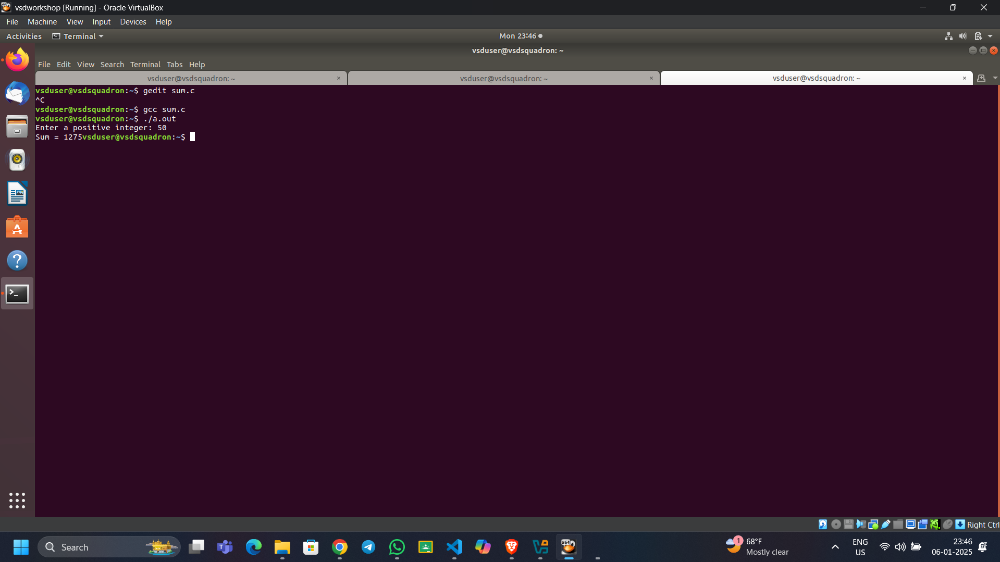
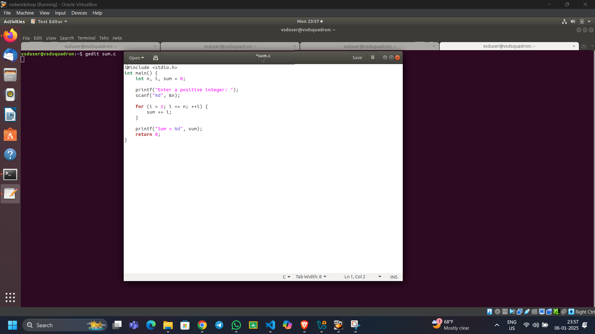
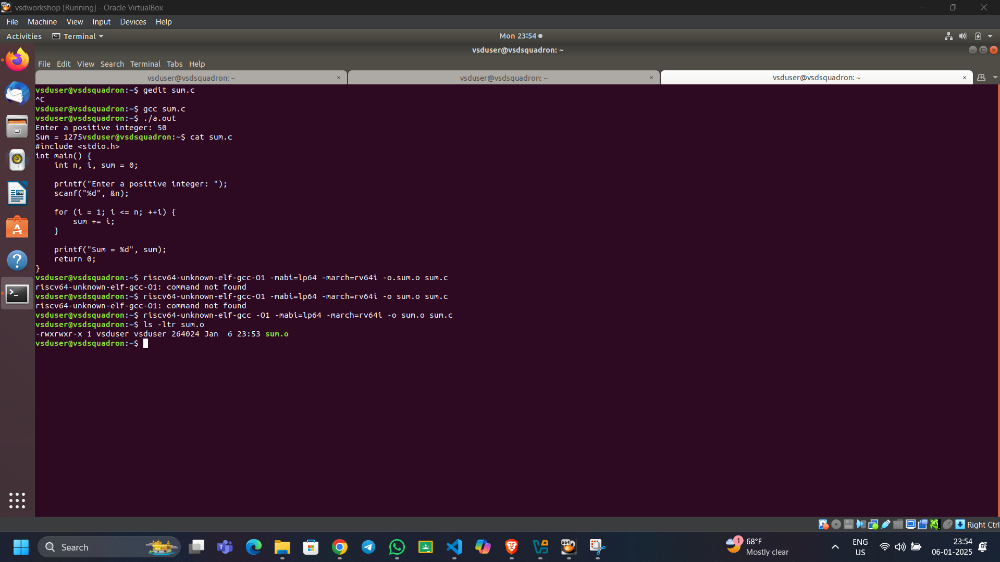
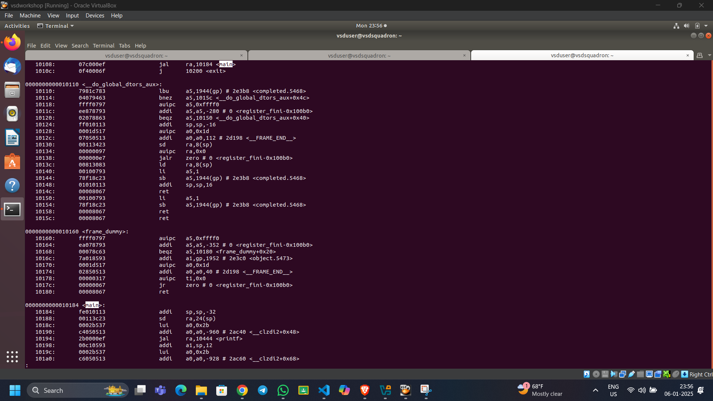
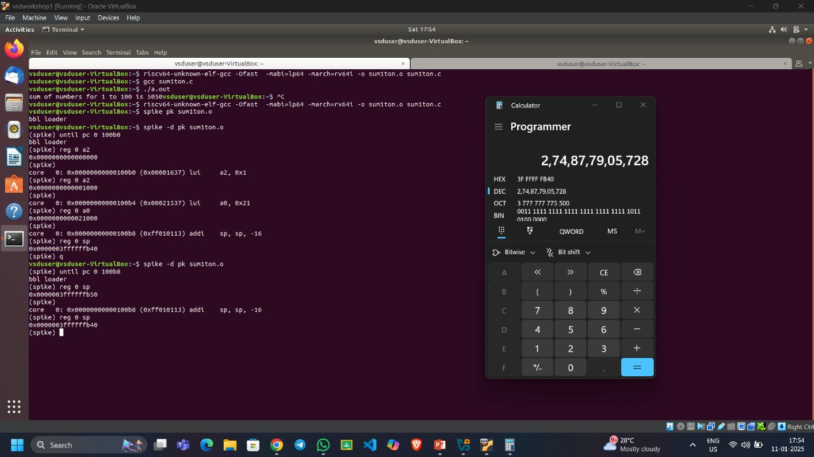
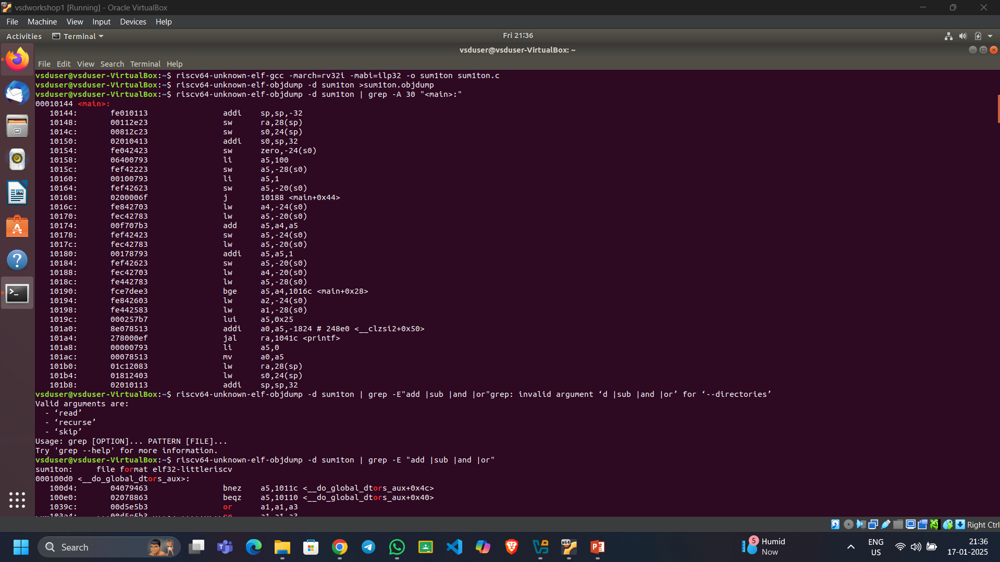
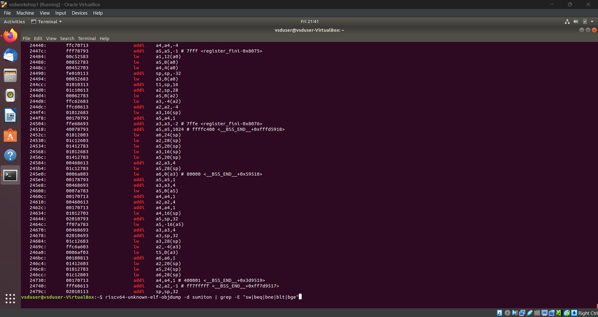
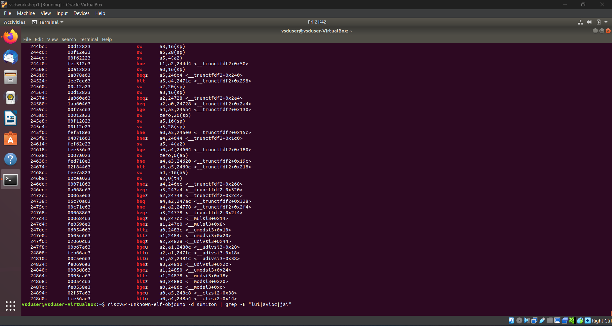

# Samsung-RISC-V-Workshop

# Samsung RISC-V Workshop Documentation

## Table of Contents
| 🏗️ Task | 📂 Description | 🔗 Link |
|---------|--------------|---------|
| 1️ | RISC-V ISA and GNU Toolchain | [Jump to Section](#task-1-risc-v-isa-and-gnu-toolchain) |
| 2️ | RISC-V Architecture Analysis | [Jump to Section](#task-2-risc-v-architecture-analysis) |
| 3️ | RISC-V Instruction Sets | [Jump to Section](#task-3-risc-v-instruction-sets) |
| 4️ | RISC-V Functional Simulation | [Jump to Section](#task-4-risc-v-functional-simulation) |
| 5 | RISC-V Project Documentation | [Jump to Section](#task-5-risc-v-project-documentation) |
## Task 1: RISC-V ISA and GNU Toolchain

### Overview
This task introduces the fundamental concepts of RISC-V Instruction Set Architecture (ISA) and sets up the development environment using the VSDSquadron board.

### Implementation Steps

#### 1. Commands to run C program in Ubantu



#### 2. C program for Sum of n integer



#### 3. Commands for Examination of generated RISC-V assembly code



#### 4. Memory Architecture Analysis (main function)



## License
This project documentation is licensed under the MIT License.

## Task 2: RISC-V Architecture Analysis
### Analysis of RISC-V architecture using spike function



## Task 3: RISC-V Instruction Sets

RISC-V (Reduced Instruction Set Computer - V) is an open-standard instruction set architecture (ISA) rooted in established reduced instruction set computing principles. Unlike proprietary ISAs, RISC-V is freely available, allowing unrestricted academic and commercial use without licensing fees. This openness has made RISC-V a compelling choice for research, education, and industry applications, promoting innovation and development across various fields.

**Significance of Instruction Formats**

Grasping the structure of instruction formats is vital for several reasons:

- Instruction Decoding: Understanding different instruction formats enables accurate decoding, essential for the CPU's correct execution of instructions.

- Pipeline Design: Instruction formats influence CPU pipeline design. Proper management ensures efficient stages of instruction fetch, decode, execution, memory access, and write-back.

- Compiler Design: Compilers generate machine code adhering to the ISA's instruction formats. A thorough understanding aids in optimizing code generation, enhancing performance and efficiency.

- Debugging and Verification: Knowledge of instruction formats assists in debugging and verifying hardware and software, helping identify issues related to incorrect instruction execution or pipeline hazards.

- Extensibility and Customization: RISC-V's modular and extensible design allows for custom extensions. Understanding base instruction formats is crucial for creating and integrating custom instructions tailored to specific applications or performance needs.

RISC-V instructions are categorized based on their field organization, with each type containing specific fields such as opcode, func3, func7, immediate values, and register numbers. The primary instruction types include:

- R-type: Register type
- I-type: Immediate type
- S-type: Store type
- B-type: Branch type
- U-type: Upper immediate type
- J-type: Jump type

**Opcode and Function Fields**

- Opcode: Specifies the instruction type.
- func3 and func7: Further define the operation within the instruction type. For instance, in R-type instructions, func3 and func7 distinguish between operations like addition and subtraction.

Immediate Values and Registers

- Immediate Values: Encoded in specific instruction fields. For example, I-type instructions use a 12-bit immediate value field along with source and destination registers.
- Registers: Specified in fields such as rd (destination register), rs1 (source register 1), and rs2 (source register 2).

Example - U-Type Instruction

Consider the `lui` (Load Upper Immediate) instruction:

- Assembly: `lui x5, 0x12345`
- Encoding: The immediate value `0x12345` is placed in the instruction’s immediate field, and the destination register `x5` is specified in the `rd` field.
- Machine Execution: The machine loads the upper 20 bits of the immediate value into the upper 20 bits of register `x5`.

Instruction Categories

- Arithmetic Instructions:
  - ADD: Adds values in two registers and stores the result in a third register.
    - Example: `ADD rd, rs1, rs2` (rd = rs1 + rs2)
  - ADDI: Adds a register and an immediate value (constant) and stores the result.
    - Example: `ADDI rd, rs1, imm` (rd = rs1 + imm)

- Logical Instructions:
  - AND, OR, XOR: Perform bitwise operations.
    - Example: `AND rd, rs1, rs2` (rd = rs1 & rs2)

- Branch Instructions:
  - BEQ: Branch if equal.
    - Example: `BEQ rs1, rs2, offset` (if rs1 == rs2, PC = PC + offset)
  - BNE: Branch if not equal.
    - Example: `BNE rs1, rs2, offset` (if rs1 != rs2, PC = PC + offset)

- Load and Store Instructions:
  - LW: Load word from memory.
    - Example: `LW rd, offset(rs1)` (rd = memory[rs1 + offset])
  - SW: Store word to memory.
    - Example: `SW rs1, offset(rs2)` (memory[rs2 + offset] = rs1)

- Special Instructions:
  - AUIPC: Add upper immediate to PC.
    - Example: `AUIPC rd, imm` (rd = PC + imm << 12)

- Branch and Jump Instructions:
  - Jump (J): Unconditional branch to a specified address.
  - Branch (B): Conditional branch based on a comparison.
# r-type instruction

# i-type insruction

# s and b type instruction

# u and j type instruction


# 1.addi(I-type)
- Instruction: addi a5, a5, 1
- Binary: 0x00178793
- Fields:
  - opcode: 0010011
  - rd: 01111 (a5)
  - rs1: 01111 (a5)
  - imm[11:0]: 000000000001
# 2.or(R-type) 
- Instruction: or a1, a1, a3
- Binary: 0x00B5B633
Fields:
   - opcode: 0110011
   - rd: 01011 (a1)
   - rs1: 01011 (a1)
   - rs2: 01101 (a3)
   - funct3: 110
# 3.add(R-type)
- instruction add a5, a4, a5:
- Binary: 0x00F78733
Fields: 
  - opcode: 0110011
  - rd: 01111 (a5)
  - rs1: 01110 (a4)
  - rs2: 01111 (a5)
  - funct3: 000
# 4.lw(I-type)
- instruction lw a2,-24(s0)
- Binary: 0xFF443603
Fields: 
  - opcode: 0000011
  - rd: 01100 (a2)
  - rs1: 01000 (s0)
  - imm[11:0]: 111111110100 (-24)
# 5.jarl(u-Type)
- instruction a5
- Binary: 0x0000F067
Fields: 
  - opcode: 1100111
  - rd: 01111 (a5)
  - rs1: 00000 (zero)
  - imm[11:0]: 000000000000
# 6.BEQ (B-type)
- instruction beq a0,zero,10
- Binary: 0x00050863
  - Fields:
  - opcode: 1100011
  - funct3: 000
  - rs1: 01010 (a0)
  - rs2: 00000 (zero)
  - imm[12:1]: 000000001000
# 7. SW (S-type)
- instruction  sw a0,0(s1)
- Binary: 0x00A4A023
Fields:
  - opcode: 0100011
  - funct3: 010
  - s1: 01001 (s1)
  - rs2: 01010 (a0)
  - imm[11:0]: 000000000000
# 8.JAL (J-type)
- instruction jal ra,800
- Binary: 0x008000EF
Fields:
  - opcode: 1101111
  - rd: 00001 (ra)
  - imm[20:1]: 00000001000
# 9.SUB (R-type)
- instruction sub a0,a0,a1
- Binary: 0x40B50533
Fields:
  - opcode: 0110011
  - rd: 01010 (a0)
  - rs1: 01010 (a0)
  - rs2: 01011 (a1)
  - funct7: 0100000
# 10.mv(I-type)
- Instruction: mv a0, a5 (encoded as addi a0, a5, 0)
- Binary: 0x00078513
Fields:
  - opcode: 0010011
  - rd: 01010 (a0)
  - rs1: 01111 (a5)
  - imm[11:0]: 000000000000 (0)
# 11.blt(SB type)
- Instruction: blt a1, a2, 16
- Binary: 0x0085C463
Fields:
  - opcode: 1100011
  - rs1: 01011 (a1)
  - rs2: 01100 (a2)
  - imm[12|10:5|4:1|11]: 000000001000 (offset = 16)
# 12.s11(R-type)
- Instruction: sll a2, a1, a0
Fields:
  - opcode: 0110011 (R-type)
  - funct7: 0000000
  - rs2: 01010 (a0)
  - rs1: 01011 (a1)
  - funct3: 001 (shift left logical)
  - rd: 01100 (a2)
  - 32-bit Representation: `0x00A5C


endcase
end
//WRITE BACK STAGE END

endmodule

## Task 4: RISC-V Functional Simulation
### add r6,r3,r2 //32'h02328400

### sub r7,r4,r2 //32'h02429380;     

###  and r8,r6,r3 //32'h0263a400

###  or r9,r7,r5 //32'h02743480

### xor r10,r8,r4 //32'h0284c500

### slt r11,r9,r4 //32'h02955580

### addi r12,r10,5 //32'h00A60600

### sw r5,r9,5 // 32'h00518181 

###  lw r13,r6,6 //32'h00628681

###  beq r1,r1,15 //32'h00f10002


## Task 5: RISC-V Project Documentation


# **Automated Door Opening and Closing System**

## ✪ **Introduction**
In today’s world, automation has become a key component in various sectors, enhancing convenience, security, and hygiene. One of the most widely implemented automation systems is the **automatic door opening and closing system**, which is extensively used in commercial buildings, hospitals, and smart homes. This document explores the design, working principle, and applications of an automatic door system based on **ultrasonic sensors and servo motors**.

## ✪ **System Overview**
The automatic door system is designed to detect the presence of a person using an **HC-SR04 ultrasonic sensor** and control the movement of a **servo motor (SG90)** to open and close the door. The entire process is managed by a **microcontroller**, which processes the sensor data and sends the appropriate signals to the motor.

## ✪ **Components Used**
The system primarily consists of the following components:
1. **HC-SR04 Ultrasonic Sensor** – Detects the presence of an approaching person by measuring distance using ultrasonic waves.
2. **Microcontroller Unit** – Processes sensor data and controls the servo motor.
3. **SG90 Servo Motor** – Mechanically operates the door by rotating to open and close it.
4. **Power Supply Unit** – Provides the necessary voltage and current to the circuit.

## ✪ **Working Principle**
### **1. Detection Using Ultrasonic Sensor**
The **HC-SR04 ultrasonic sensor** emits high-frequency sound waves and measures the time it takes for the waves to bounce back after hitting an object. Based on this time, it calculates the distance of the object (person) from the door.
- If the detected distance is within a predefined threshold (e.g., **less than 50 cm**), the sensor sends a signal to the microcontroller to trigger the door-opening mechanism.

### **2. Processing by the Microcontroller**
Once the microcontroller receives the signal from the sensor, it processes the information and generates a control signal for the **servo motor**.

### **3. Servo Motor Operation**
The **SG90 servo motor** is responsible for the movement of the door. It operates in the following manner:
- When an object is detected, the servo rotates to **open** the door.
- After a certain delay (e.g., **5 seconds**), if no object is detected, the servo rotates back to **close** the door.

## ✪ **Block Diagram Representation**

The block diagram consists of:
- An **ultrasonic sensor** connected to the microcontroller for distance measurement.
- A **servo motor** linked to the microcontroller to operate the door.
- Power connections to supply voltage to all components.

## ✪ **Advantages of Automatic Doors**
- **Touchless Operation:** Enhances hygiene, especially in hospitals and high-traffic areas.
- **Energy Efficiency:** Reduces heat and air conditioning losses by opening only when needed.
- **Security:** Restricts unauthorized access and integrates well with authentication systems.
- **Convenience:** Provides easy access for people carrying luggage, disabled individuals, or elderly users.
## Task 6: RISC-V Project presentation
```cpp
#include <ch32v00x.h>
#include <debug.h>

/* Distance threshold in cm for detecting a person */
#define PERSON_DETECTION_THRESHOLD 50 

/* Function prototypes */
void TIM1_PWMOut_Init(uint16_t arr, uint16_t psc, uint16_t ccp);
void GPIO_Config(void);
uint32_t Ultrasonic_Read(void);
float Calculate_Distance(uint32_t echoTime);
void Set_Servo_Angle(uint8_t angle);

/* Function to initialize PWM on Timer 1 for the servo motor */
void TIM1_PWMOut_Init(uint16_t arr, uint16_t psc, uint16_t ccp)
{
    GPIO_InitTypeDef GPIO_InitStructure = {0};
    TIM_OCInitTypeDef TIM_OCInitStructure = {0};
    TIM_TimeBaseInitTypeDef TIM_TimeBaseInitStructure = {0};

    RCC_APB2PeriphClockCmd(RCC_APB2Periph_GPIOD, ENABLE);
    GPIO_InitStructure.GPIO_Pin = GPIO_Pin_2;
    GPIO_InitStructure.GPIO_Mode = GPIO_Mode_AF_PP; // Alternate Function Push-Pull
    GPIO_InitStructure.GPIO_Speed = GPIO_Speed_10MHz;
    GPIO_Init(GPIOD, &GPIO_InitStructure);

    RCC_APB2PeriphClockCmd(RCC_APB2Periph_TIM1, ENABLE);
    TIM_TimeBaseInitStructure.TIM_Period = arr;
    TIM_TimeBaseInitStructure.TIM_Prescaler = psc;
    TIM_TimeBaseInitStructure.TIM_ClockDivision = TIM_CKD_DIV1;
    TIM_TimeBaseInitStructure.TIM_CounterMode = TIM_CounterMode_Up;
    TIM_TimeBaseInit(TIM1, &TIM_TimeBaseInitStructure);

    TIM_OCInitStructure.TIM_OCMode = TIM_OCMode_PWM1;
    TIM_OCInitStructure.TIM_OutputState = TIM_OutputState_Enable;
    TIM_OCInitStructure.TIM_Pulse = ccp;
    TIM_OCInitStructure.TIM_OCPolarity = TIM_OCPolarity_High;
    TIM_OC1Init(TIM1, &TIM_OCInitStructure);
    TIM_CtrlPWMOutputs(TIM1, ENABLE);
    TIM_OC1PreloadConfig(TIM1, TIM_OCPreload_Disable);
    TIM_ARRPreloadConfig(TIM1, ENABLE);
    TIM_Cmd(TIM1, ENABLE);
}

/* Function to configure GPIO Pins */
void GPIO_Config(void)
{
    GPIO_InitTypeDef GPIO_InitStructure = {0};

    RCC_APB2PeriphClockCmd(RCC_APB2Periph_GPIOD, ENABLE);

    // Pin 3: Input for Ultrasonic sensor echo
    GPIO_InitStructure.GPIO_Pin = GPIO_Pin_3;
    GPIO_InitStructure.GPIO_Mode = GPIO_Mode_IPU; // Input with Pull-Up
    GPIO_Init(GPIOD, &GPIO_InitStructure);

    // Pin 4: Output for Ultrasonic sensor trigger
    GPIO_InitStructure.GPIO_Pin = GPIO_Pin_4;
    GPIO_InitStructure.GPIO_Mode = GPIO_Mode_Out_PP; // Output Push-Pull
    GPIO_InitStructure.GPIO_Speed = GPIO_Speed_50MHz;
    GPIO_Init(GPIOD, &GPIO_InitStructure);

    // Pin 6: LED indicator
    GPIO_InitStructure.GPIO_Pin = GPIO_Pin_6;
    GPIO_InitStructure.GPIO_Mode = GPIO_Mode_Out_PP; // Output Push-Pull
    GPIO_InitStructure.GPIO_Speed = GPIO_Speed_50MHz;
    GPIO_Init(GPIOD, &GPIO_InitStructure);
}

/* Function to trigger the ultrasonic sensor and read the echo duration */
uint32_t Ultrasonic_Read(void)
{
    uint32_t echoTime = 0;
    uint32_t timeout = 1000000; // Timeout to prevent infinite loops

    GPIO_WriteBit(GPIOD, GPIO_Pin_4, SET); // Trigger Pulse
    Delay_Us(10);
    GPIO_WriteBit(GPIOD, GPIO_Pin_4, RESET);

    while (GPIO_ReadInputDataBit(GPIOD, GPIO_Pin_3) == Bit_RESET && timeout--); // Wait for Echo start
    if (timeout == 0) return 0; // Timeout, no valid signal

    timeout = 1000000; // Reset timeout
    while (GPIO_ReadInputDataBit(GPIOD, GPIO_Pin_3) == Bit_SET && timeout--) echoTime++; // Measure Echo time

    return (timeout == 0) ? 0 : echoTime; // Return 0 if timeout
}

/* Function to calculate distance from echo time */
float Calculate_Distance(uint32_t echoTime)
{
    return (echoTime * 0.0343) / 2; // Convert time to distance in cm
}

/* Function to set servo motor angle (0° to 90° for door open/close) */
void Set_Servo_Angle(uint8_t angle)
{
    uint16_t pulseWidth;

    // Map angle (0°–180°) to pulse width (1ms–2ms) in 20ms period
    pulseWidth = 1000 + ((angle * 1000) / 180); 

    // Set PWM with mapped pulse width
    TIM1_PWMOut_Init(20000 - 1, 48 - 1, pulseWidth);
}

/* Main function */
int main(void)
{
    NVIC_PriorityGroupConfig(NVIC_PriorityGroup_1);
    SystemCoreClockUpdate();
    Delay_Init();
    GPIO_Config();
    USART_Printf_Init(115200); // Initialize debug USART

    printf("Automatic Door System Initialized\n");

    while (1)
    {
        uint32_t echoTime = Ultrasonic_Read();
        if (echoTime == 0)
        {
            printf("Ultrasonic Sensor Timeout! No valid reading.\n");
            continue;
        }

        float distance = Calculate_Distance(echoTime);
        printf("Distance: %.2f cm\n", distance);

        if (distance < PERSON_DETECTION_THRESHOLD) // If a person is detected
        {
            GPIO_WriteBit(GPIOD, GPIO_Pin_6, Bit_SET); // Turn on LED
            printf("Person detected! Opening door...\n");
            Set_Servo_Angle(90); // Open door
        }
        else
        {
            GPIO_WriteBit(GPIOD, GPIO_Pin_6, Bit_RESET); // Turn off LED
            printf("No person detected. Closing door...\n");
            Set_Servo_Angle(0); // Close door
        }

        Delay_Ms(1000); // Wait before checking again
    }
}
```
### working vedio
https://github.com/user-attachments/assets/ae277ebb-9152-4361-b579-fbfa4ff6f846

### **Conclusion of the Automatic Door System Project**  

This project successfully implements an **automatic door system** using an **ultrasonic sensor** for detecting people and a **servo motor** for door movement. The system efficiently calculates distance, determines whether a person is within the detection threshold, and controls the door accordingly.  

Key takeaways:  
✅ **Reliable Person Detection** – Uses an ultrasonic sensor to measure distance accurately.  
✅ **Efficient Door Control** – A servo motor opens the door when a person is detected and closes it otherwise.  
✅ **Visual & Debugging Feedback** – An LED indicator signals detection, and a USART debug output provides real-time status updates.  
✅ **Potential Enhancements** – Future improvements could include **motion smoothing**, **manual override**, or **power optimization**.  

Overall, this project demonstrates a **practical, real-time embedded system** with **real-world applications** in **security, automation, and accessibility**. 


